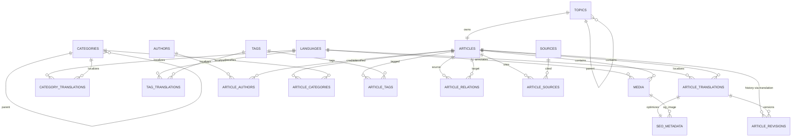

# مخطط قاعدة البيانات

## نموذج ERD منطقي

## الجداول الأساسية

| الجدول      | أهم الأعمدة                                                           | الغرض                                       |
| ----------- | --------------------------------------------------------------------- | ------------------------------------------- |
| `languages` | `code`, `name`, `native_name`, `direction`, `is_active`, `sort_order` | سجل اللغات القابل للتوسع؛ بدأ بـ `ar` و`en` |
| `topics`    | `id`, `canonical_key`, `entity_type`, `parent_topic_id`, `metadata`   | كيان منطقي واحد للموضوع بعيدًا عن اللغة     |
| `articles`  | `id`, `topic_id`, `is_featured`, `view_count`                         | حاوية المقال المرتبطة بالموضوع              |
| `authors`   | `display_name`, `bio`, `website_url`, `metadata`                      | بيانات المؤلفين والمساهمين                  |

## الترجمة والتحرير

| الجدول                 | أهم الأعمدة                                                                                                                                            | القيود المهمة                                                                                                   |
| ---------------------- | ------------------------------------------------------------------------------------------------------------------------------------------------------ | --------------------------------------------------------------------------------------------------------------- |
| `article_translations` | `article_id`, `language_code`, `title`, `slug`, `summary`, `content`, `seo_title`, `seo_description`, `keywords`, `publication_status`, `published_at` | فريد `(article_id, language_code)` وفريد `(language_code, slug)`؛ الحالات الأربع؛ يمنع النشر دون `published_at` |
| `article_revisions`    | `article_translation_id`, `version`, `title`, `summary`, `content`, SEO، الحالة، `change_note`, `created_by`                                           | فريد `(article_translation_id, version)`؛ لقطات تاريخية                                                         |
| `article_authors`      | `article_id`, `author_id`, `contribution_role`, `sort_order`                                                                                           | علاقة متعدد إلى متعدد                                                                                           |
| `seo_metadata`         | `article_translation_id`, `canonical_url`, Open Graph، Twitter/X، `noindex`, `structured_data`                                                         | صف اختياري واحد لكل ترجمة                                                                                       |

## التصنيف والعلاقات

| الجدول                  | أهم الأعمدة                                                                           | الغرض                                                                       |
| ----------------------- | ------------------------------------------------------------------------------------- | --------------------------------------------------------------------------- |
| `categories`            | `parent_id`, `sort_order`, `is_active`, `metadata`                                    | شجرة تصنيفات محايدة لغويًا                                                  |
| `category_translations` | `category_id`, `language_code`, `name`, `slug`, `description`                         | اسم ووصف وslug لكل لغة                                                      |
| `article_categories`    | `article_id`, `category_id`, `is_primary`, `sort_order`                               | ربط مقال بعدة تصنيفات مع تصنيف أساسي واحد كحد أقصى                          |
| `tags`                  | `canonical_key`                                                                       | هوية الوسم المحايدة لغويًا                                                  |
| `tag_translations`      | `tag_id`, `language_code`, `name`, `slug`                                             | أسماء الوسوم متعددة اللغات                                                  |
| `article_tags`          | `article_id`, `tag_id`                                                                | علاقة متعدد إلى متعدد                                                       |
| `article_relations`     | `source_article_id`, `target_article_id`, `relation_type`, `relation_key`, `metadata` | `related`, `similar`, `parent_topic`, `child_topic`, `references` و`custom` |

## المصادر والوسائط

| الجدول            | أهم الأعمدة                                                                                                                                      | الغرض                                                                   |
| ----------------- | ------------------------------------------------------------------------------------------------------------------------------------------------ | ----------------------------------------------------------------------- |
| `sources`         | `name`, `source_type`, `url`, `source_author`, `publication_date`, `accessed_at`, `notes`, `metadata`                                            | مصدر قابل لإعادة الاستخدام بين عدة مقالات                               |
| `article_sources` | `article_id`, `source_id`, `citation_note`, `sort_order`                                                                                         | علاقة متعدد إلى متعدد بين المقالات والمصادر                             |
| `media`           | `article_id`, `storage_bucket`, `storage_path`, `filename`, `mime_type`, `file_size_bytes`, `alt_text`, `caption`, `language_code`, `is_primary` | metadata لملفات Supabase Storage مع صورة رئيسية واحدة كحد أقصى لكل مقال |

## الفهارس

| الفهرس                                                          | النوع         | الاستخدام                                                    |
| --------------------------------------------------------------- | ------------- | ------------------------------------------------------------ |
| مفاتيح فريدة على `canonical_key`, slugs, أزواج اللغة/الكيان     | B-tree/unique | منع التكرار وتسريع الوصول المباشر                            |
| `article_translations_status_idx`                               | B-tree        | تصفية اللغة والحالة                                          |
| `article_translations_published_at_idx`                         | B-tree جزئي   | أحدث المقالات المنشورة                                       |
| فهارس parent/category/tag/relation/source/media                 | B-tree        | joins وعرض الشجرة والعلاقات                                  |
| `article_translations_search_text_pgroonga_idx`                 | PGroonga      | البحث الموحّد في العنوان والملخص والمحتوى والكلمات المفتاحية |
| `article_translations_title_pgroonga_idx`, `summary`, `content` | PGroonga      | فهارس منفصلة للتوسع والاستعلامات المتخصصة                    |

## سياسة البحث

يُنشأ `search_text` كعمود نصي يُحدّث تلقائيًا عبر trigger من العنوان والملخص والمحتوى والكلمات المفتاحية. الدالة `public.search_articles(search_query, requested_language, page_size, page_offset)` تبحث في الترجمات المنشورة باللغة المطلوبة باستخدام `&@~`، وتعيد `relevance` محسوبًا بأولوية العنوان ثم الملخص ثم الكلمات المفتاحية ثم المحتوى. الحد الأقصى للصفحة 100 صف.

لا يُخلط النص العربي والإنجليزي في صف واحد؛ تختار الواجهة `language_code` صراحةً. إضافة لغة مستقبلية تعني إدخال صف في `languages` ثم إنشاء ترجمة جديدة، دون تغيير أي جدول أو فهرس.

## الوصول والأمان

فُعّلت RLS على كل جداول المجال. سياسات `anon` و`authenticated` تسمح بالقراءة فقط للبيانات المنشورة أو المرتبطة بها. لا توجد سياسات كتابة عامة. سجلات الإصدارات خاصة عمدًا. عمليات الإدارة المستقبلية يجب أن تتم عبر خادم موثوق أو Edge Function باستخدام service role، وليس من المتصفح.
